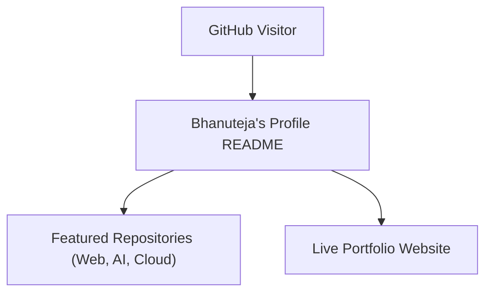
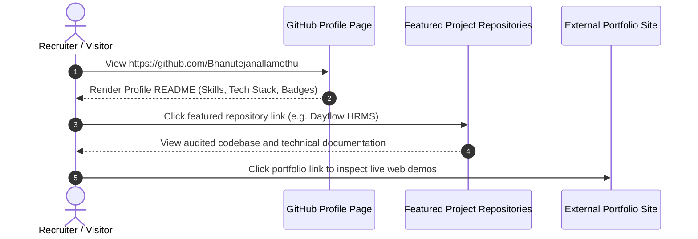

# Bhanuteja Nallamothu — Full-Stack Engineer & Software Architect

## Overview
Welcome to the personal GitHub profile and engineering hub of **Bhanuteja Nallamothu**. This repository powers the GitHub profile overview page, summarizing technical competencies, architectural domains, core open-source projects, and engineering philosophy.

- **Focus Areas:** Full-Stack Web Development, Cloud-Native Architectures, AI/ML Engineering, and DevSecOps.
- **Location:** India.
- **Status:** Active Engineer & Open-Source Contributor.

## Features
- **Comprehensive Tech Stack Overview:** Languages, frameworks, databases, and DevOps tools.
- **Featured Projects Showcase:** Highlighting production applications and open-source contributions.
- **Interactive Badges & Statistics:** Dynamic GitHub profile telemetry and commit activity metrics.
- **Connect & Collaborate Links:** Direct links to LinkedIn, Portfolio, and professional contact channels.

## Architecture


## User Flow


## Technology Stack
| Domain | Technologies |
|---|---|
| **Languages** | TypeScript, JavaScript, Java, Python, SQL, HTML5, CSS3 |
| **Frontend** | React, Next.js, Vite, Tailwind CSS, Radix UI, Shadcn UI |
| **Backend** | Node.js, Express, Spring Boot, FastAPI, REST APIs, WebSockets |
| **Databases** | MySQL, PostgreSQL, MongoDB, Firebase Firestore |
| **DevOps & Cloud** | Docker, Docker Compose, Nginx, GitHub Actions, Vercel, Firebase |

## Infrastructure
Hosted natively on GitHub's special user profile repository feature (`username/username`).

## Project Structure
```text
Bhanutejanallamothu/
├── .gitignore           # Git ignore definitions
└── README.md            # Special profile markdown representation
```

## Prerequisites
*GitHub account and markdown renderer.*

## Environment Variables
*Not applicable.*

## Local Development Setup
1. Clone repository:
   ```bash
   git clone https://github.com/Bhanutejanallamothu/Bhanutejanallamothu.git
   ```
2. Preview markdown in any editor (VS Code, Typora).

## Docker Setup
*Not applicable.*

## Database Setup
*Not applicable.*

## API Documentation
*Not applicable.*

## Deployment
Changes committed and pushed to `main` branch automatically update the public profile at `https://github.com/Bhanutejanallamothu`.

## Security
- Profile contains no private contact data or credentials.
- All links verified for secure HTTPS transport.

## Testing
Verify rendering formatting in GitHub web preview.

## Troubleshooting
- **Badges Not Rendering:** Verify third-party badge providers (shields.io) status.

## Future Improvements
- Automated GitHub Actions workflow to dynamically update latest blog posts and recent contributions.

## License
Open content. All rights reserved by Bhanuteja Nallamothu.
